# FOCUS — 언론 보도 비평 기사 AI 에이전트

여러 언론사가 같은 사안을 어떻게 다르게 다뤘는지 비교하는 **비평 기사를 기자가 AI와 함께 쓰는 시스템**입니다.
기자가 각 매체 사설을 직접 읽고 인용할 구절을 발췌하면 AI는 **그 발췌만을 근거로** 초안을 쓰고,
무엇을 비평할지 고르는 일과 최종 검토·발행은 항상 기자와 데스크가 합니다.

미디어스 현장실습 인턴 프로젝트 (2026. 7. 1. ~ 8. 30.)

## 화면 안내

| 단계 | 화면 |
|---|---|
| **이슈 탐색 홈** — 날짜별 지표, 이어서 할 일, 오늘의 사설 | 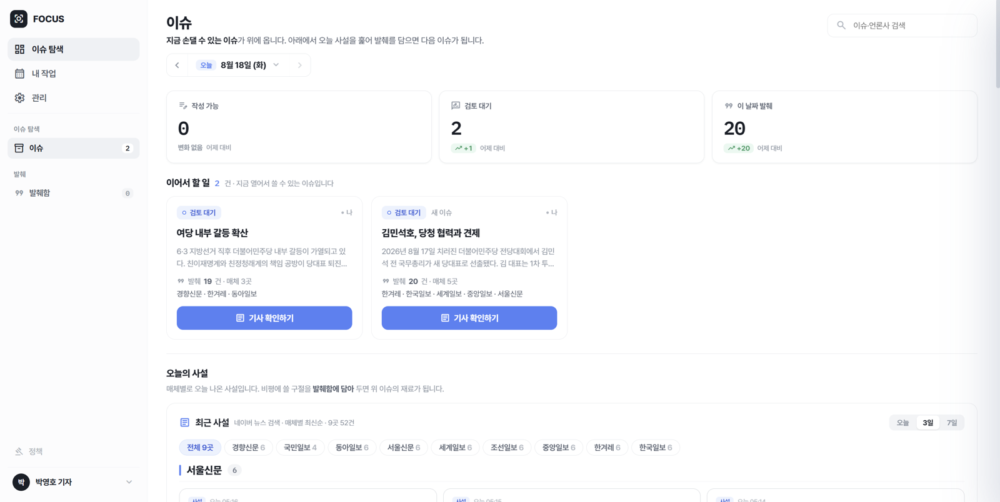 |
| **최근 사설** — 네이버 뉴스 검색 통과 조회(9개 매체), 원문 링크 | 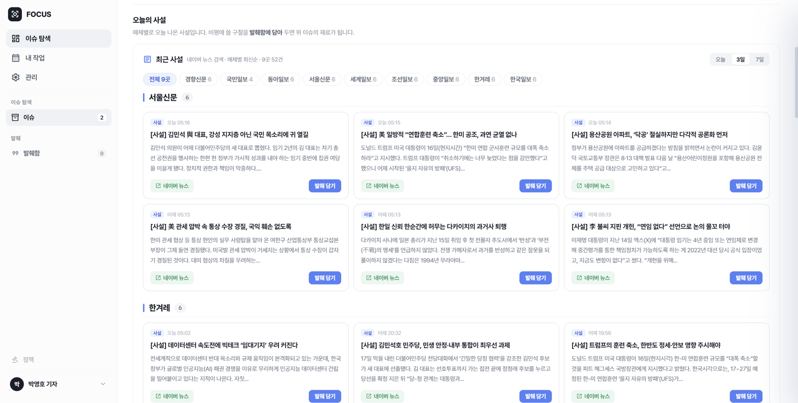 |
| **발췌 담기** — 주장/사실 구분 입력, 구절당 최대 1,000자 | 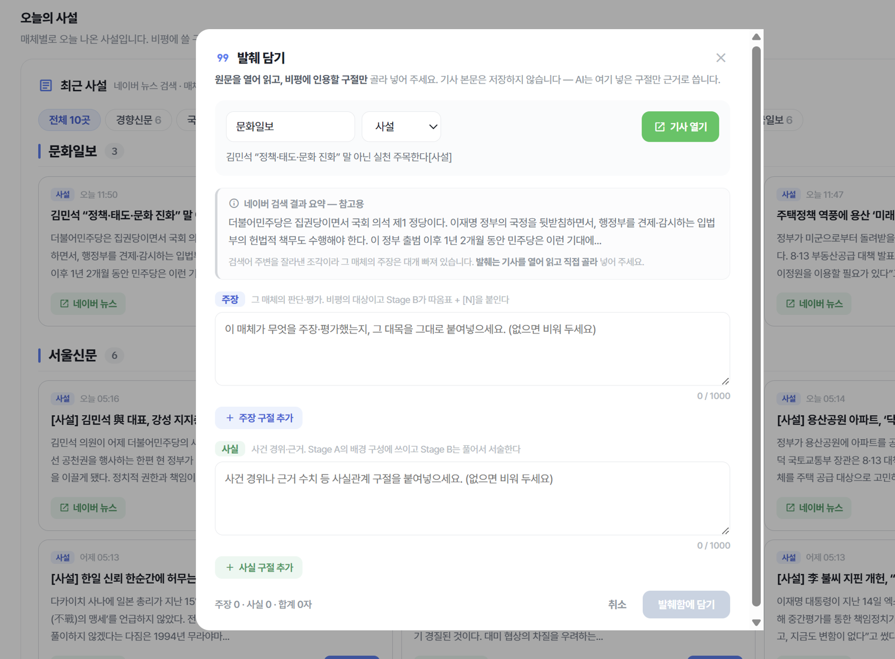 |
| **발췌함** — 발췌를 묶어 이슈 생성, 매체당 1,200자 한도 표시 | 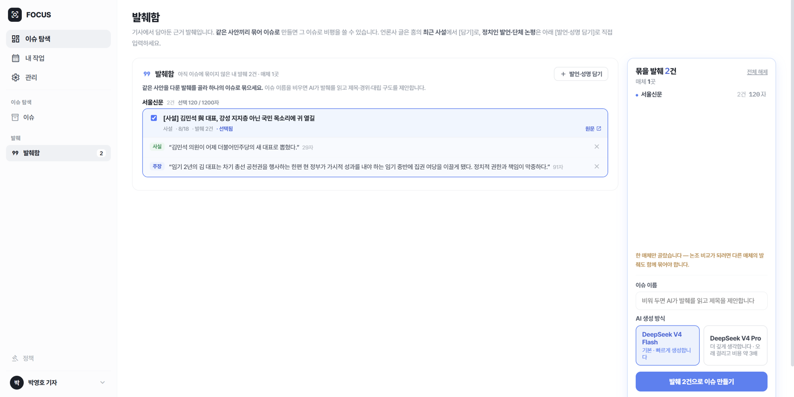 |
| **이슈 상세** — 진행 단계, 사건 정리(해석 배제), 진영별 발췌 | 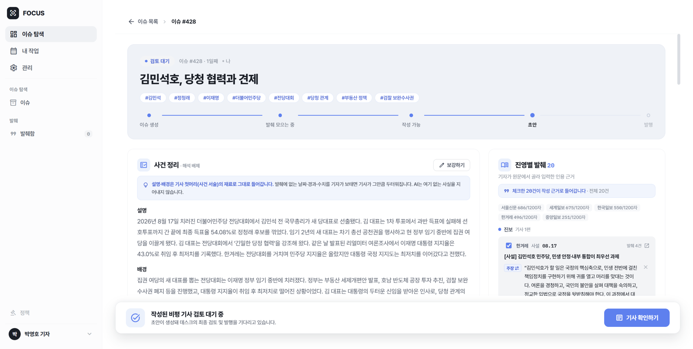 |
| **워크스페이스** — 좌: 근거 발췌 / 중: 초안 에디터 / 우: 근거 원문 대조 | 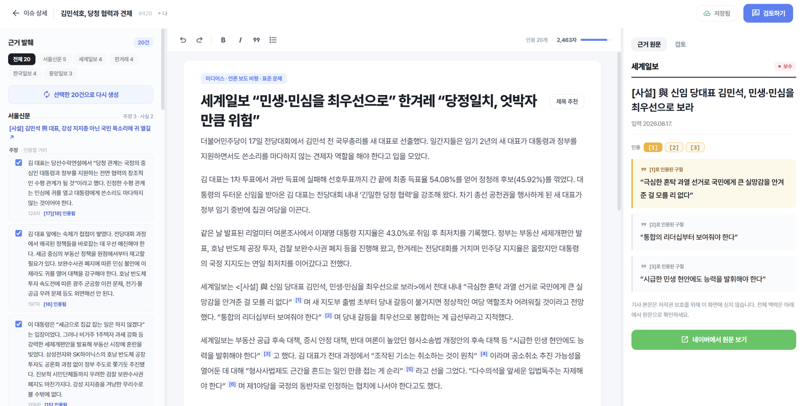 |
| **검토 패널** — 인용 원문 대조, 인용 총량 검사, 발행 | 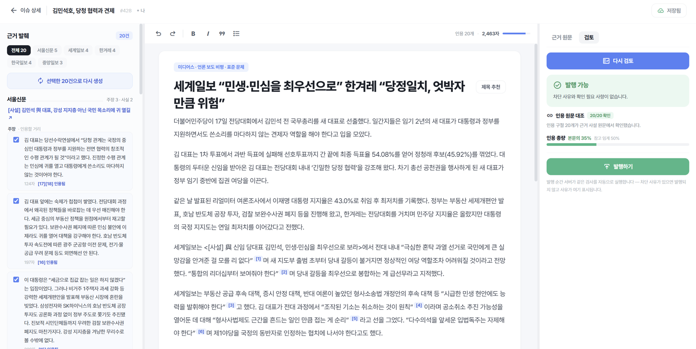 |
| **내 작업** — 작성·검토·발행 달력, 날짜별 상세, 메모 | 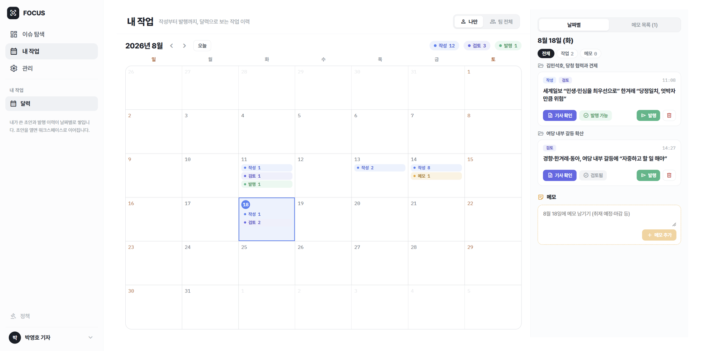 |

그 밖의 화면 — 로그인 · 관리(관리자 전용)

| 화면 | |
|---|---|
| **로그인** — 승인된 사내 이메일만 가입 | 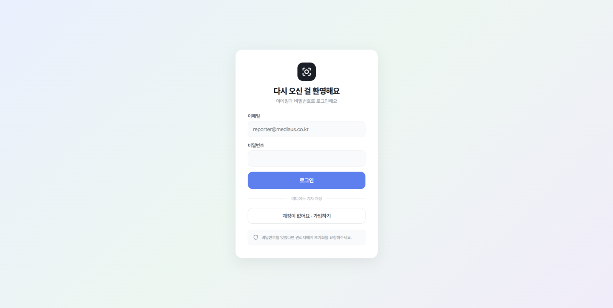 |
| **계정 만들기** | 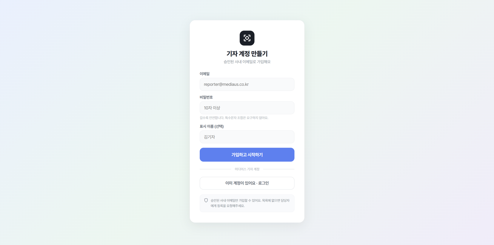 |
| **시스템 상태** — DB·스키마·API 키 점검, 자원 사용률 | 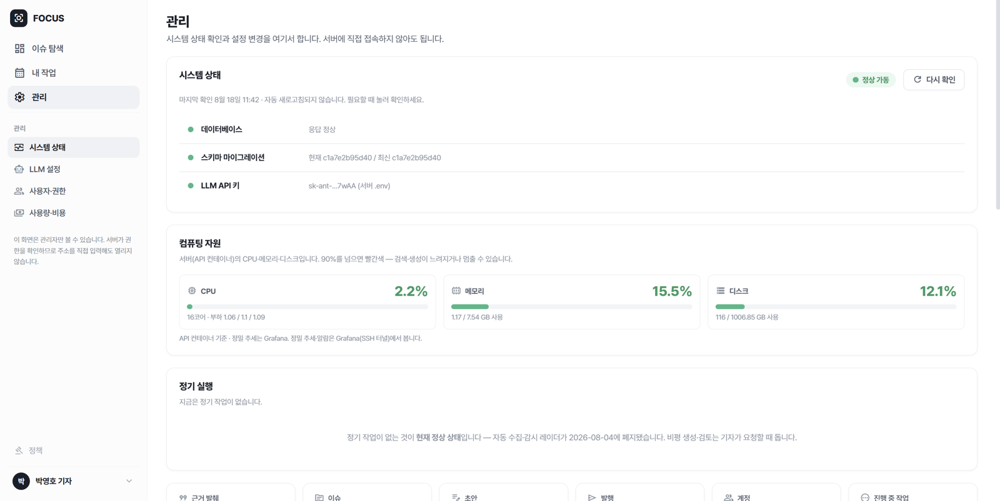 |
| **사용자·권한** — 가입 허용목록, 역할 변경 | 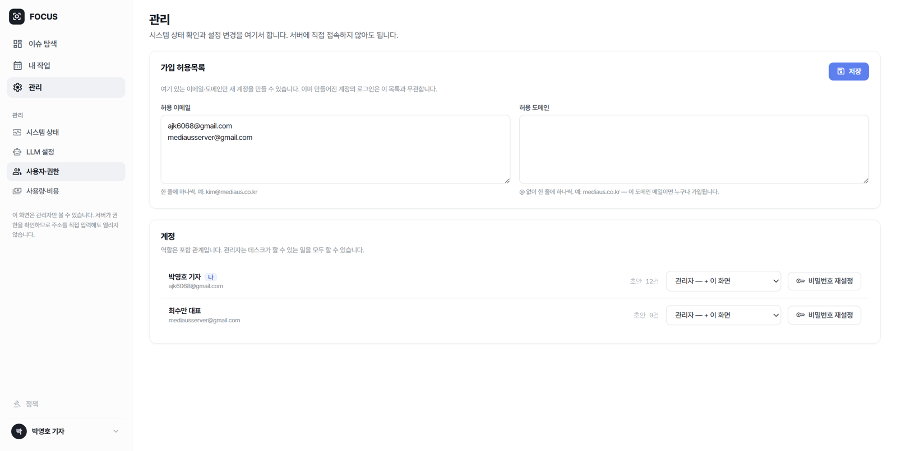 |
| **LLM 설정** — API 키 교체, 연결 테스트 | 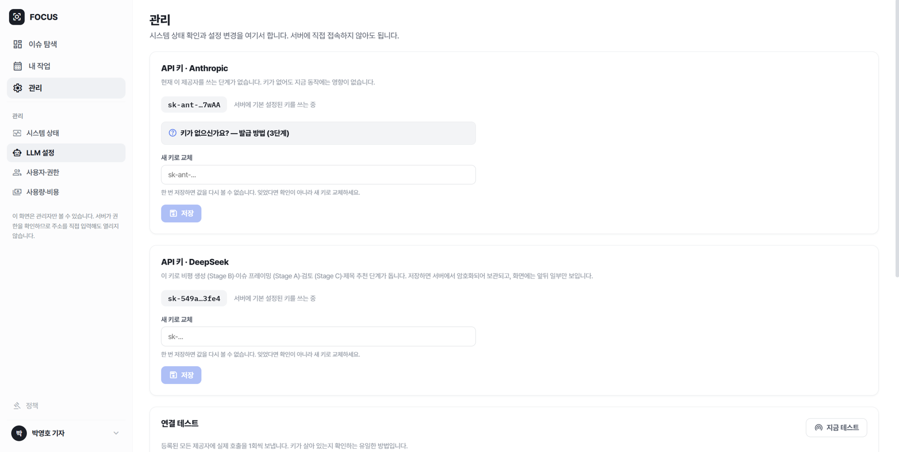 |
| **사용량·비용** — 기간별 추정 비용, 작업별 내역 | 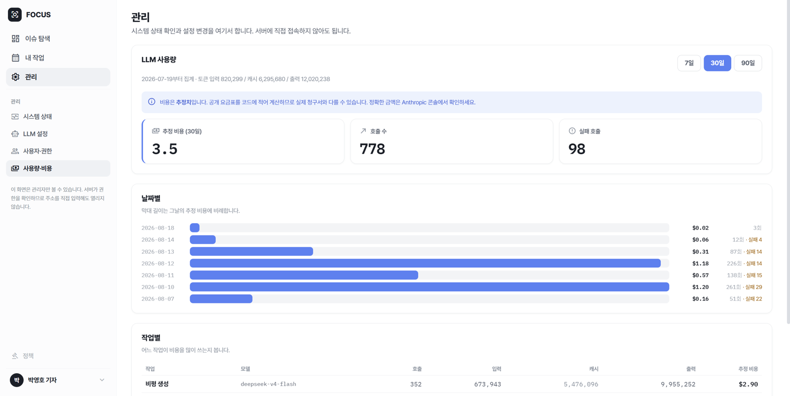 |

## 아키텍처

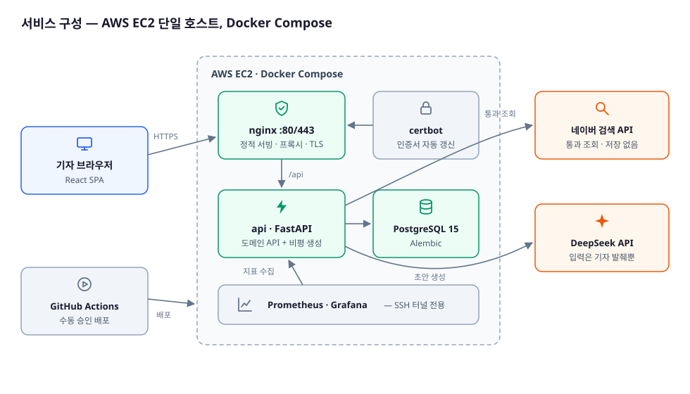

| 영역 | 구성 |
|---|---|
| 백엔드 | FastAPI · SQLAlchemy 2.0 · PostgreSQL 15 · Alembic |
| 프론트 | React · TypeScript · Vite |
| AI | DeepSeek V4 — 이슈 프레이밍(Stage A) · 근거 기반 초안(Stage B) · 제목 추천. 검토(Stage C)는 코드 검사 |
| 배포 | AWS EC2 · Docker Compose · nginx(TLS, certbot) · GitHub Actions(배포는 수동 승인 실행) |
| 감시 | Prometheus · Grafana — 127.0.0.1 바인딩, SSH 터널로만 접근 |

## 핵심 모듈 세부

### 기사 작성 흐름 — 발췌에서 발행까지

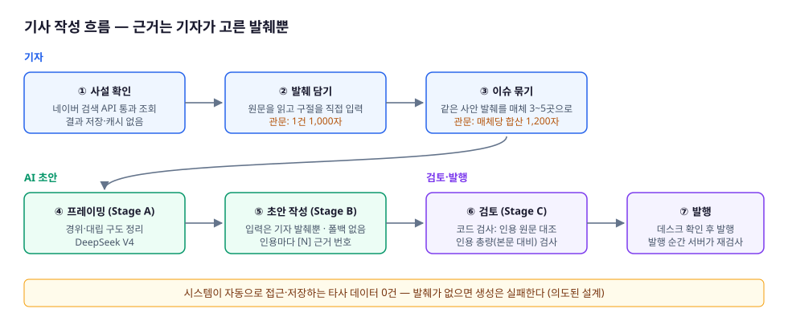

- **근거는 기자가 고른 발췌뿐** — AI는 발췌함에 담긴 구절만 인용하며, 발췌에 없는 사실을 지어내지 않습니다.
- **기사 본문은 저장하지 않음** — 원문 전체가 아닌, 인용할 구절만 시스템에 담습니다.
- **발행 전 반드시 검토** — 인용 원문 대조와 인용 총량 검사를 통과해야 발행되며, 발행 순간 서버가 같은 검사를 다시 실행합니다.

### 품질 평가·개선 — 느낌이 아니라 수치로

AI가 그럴듯한 글을 쓰게 두지 않고, 미디어스 실제 기사를 기준 삼아 재면서 고쳤습니다.

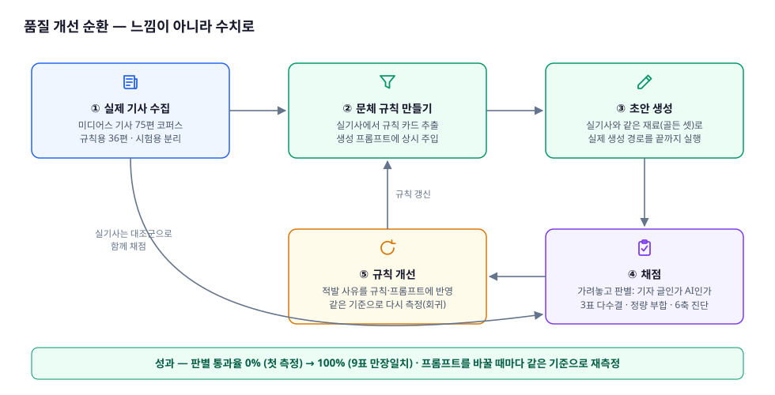

- 실제 기사 75편으로 기준 자료를 만들되, 규칙을 뽑는 36편과 시험용을 분리했습니다(학습·시험 분리).
- 실기사에서 뽑은 문체 규칙을 생성 프롬프트에 상시 주입합니다.
- 실기사와 같은 재료(골든 셋)로 생성한 초안을 심사자가 가려놓고 "기자 글인가 AI인가"를 판별합니다(3표 다수결).
  실기사도 대조군으로 함께 채점해 심사자 자체의 신뢰도를 확인합니다.
- 적발 사유를 규칙에 반영하고 같은 기준으로 재측정합니다 — **판별 통과율 0%(첫 측정) → 100%(9표 만장일치)**.

## 운영 비용 — 월 기준

| 항목 | 월 비용 |
|---|---|
| AWS EC2 t3.medium (서울, 온디맨드) | 약 $38 |
| EBS 저장 공간 (gp3 30GB) | 약 $3 |
| DeepSeek API | **$3.5** — 30일 실측(호출 778회, 평가 실험 포함) |
| 네이버 검색 API | 무료 (일 25,000회 한도) |
| **합계** | **약 $45 / 월** |

LLM 비용이 전체의 1할 미만입니다. DeepSeek은 캐시에 든 입력이 안 든 입력의 1/50 가격이라
프롬프트 캐시 설계가 비용을 좌우하며, 관리 화면에서 날짜별·작업별 사용량을 상시 확인합니다.

## 데이터·저작권 원칙

이 시스템은 기사를 크롤링하지 않습니다. 네이버 검색 API로 조회하고 결과를 저장하지 않으며,
AI가 읽는 타사 텍스트는 기자가 원문을 읽고 손으로 고른 발췌뿐입니다.

| 하지 않는 것 | 하는 것 |
|---|---|
| 기사 본문 수집·저장 (크롤러·군집·매칭 엔진 제거, 2026-08-04 폐지) | 네이버 검색 API 통과 조회 — 무변형 노출, 우리 판단(매체명 등)은 별도 배열로 전달 |
| 검색 결과 저장·캐시 — 열 때마다 다시 조회 | 인용 판단과 책임을 사람에게 — 기자가 원문을 읽고 직접 발췌 |
| 검색 결과를 AI에 넣어 가공 | 인용량 상한 — 1건 1,000자 · 매체당 1,200자, 이슈로 묶는 시점에 합산 재검사 |
| 타사 기사 전문을 AI에 투입 — 폴백 없음, 발췌 0건이면 생성 실패(의도된 설계) | 구절마다 출처 표기 — 매체·제목·링크·발행일 저장, 발행 기사까지 유지 |

근거: 네이버 오픈API 이용약관 제7조 3항 ③ · 검색 API 특약 2.1 · 저작권법 제28조(공표된 저작물의 인용)

---

전체 코드와 개발 기록은 비공개 저장소 `FOCUS-App`에 있습니다.
